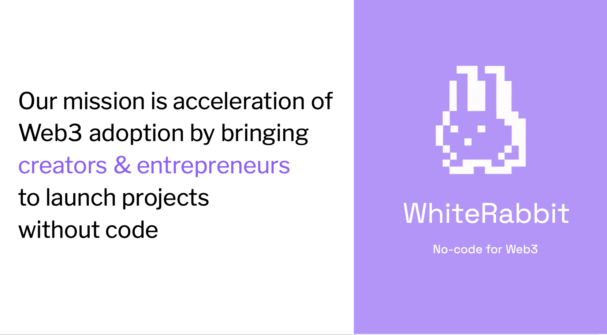
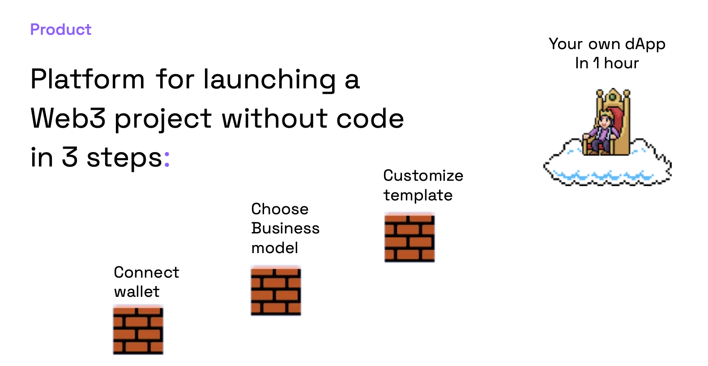
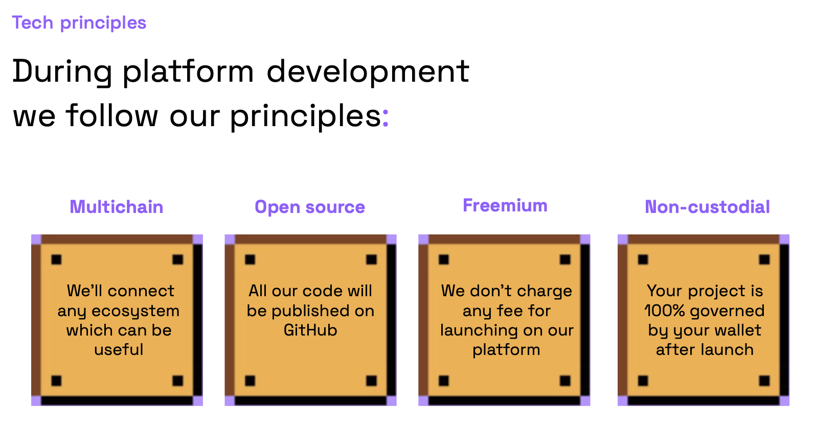
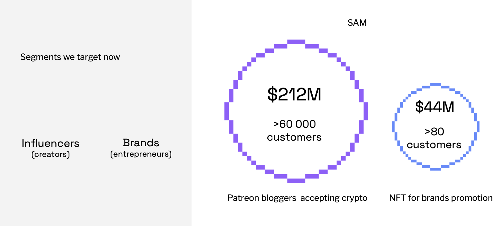
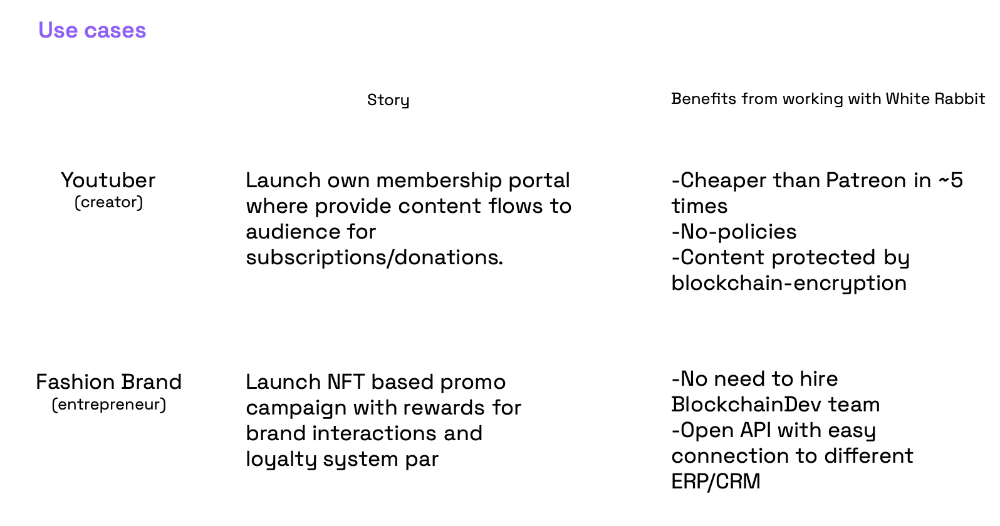
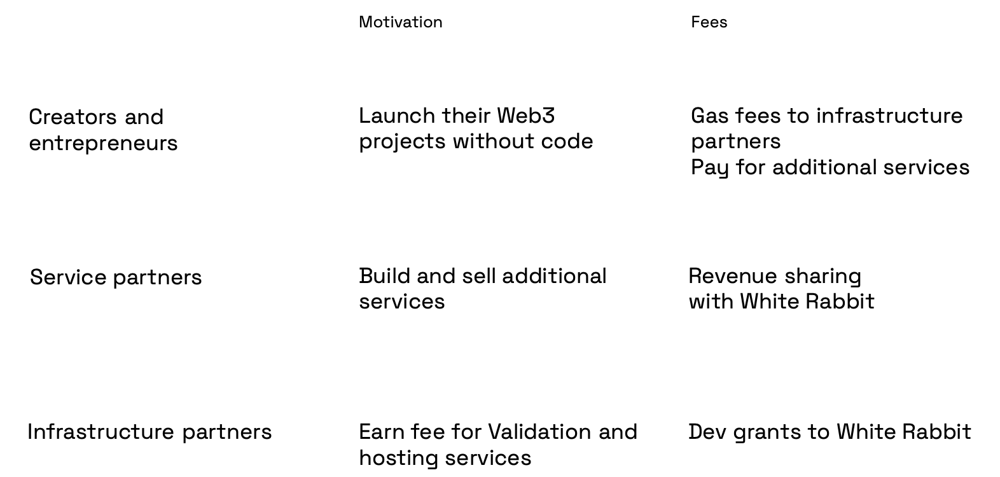
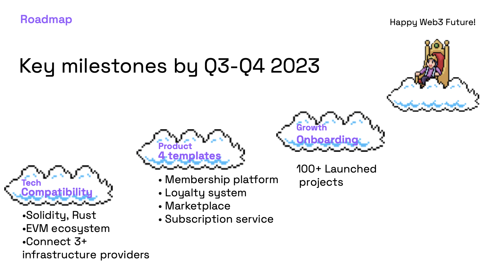
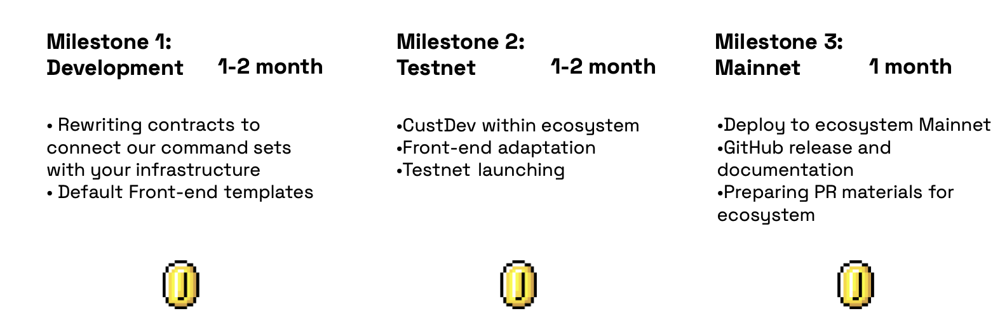

## White Rabbit

White Rabbit is an open source Web3 platform designed for launching dApps without coding

## 

### Problem

Currently, Web3 adoption is too low because of **developer-oriented infrastructure** 

Our vision is that Web3 adoption will come when anybody is able to launch Web3 project **without code** 

### Product

We aimed to deliver a Web3 platform where customers could launch their own dApp in 1 hour without code. 

All you need to do is these 3 steps:

**Connect wallet.** Connect a wallet to get a private key and govern the dApp (White Rabbit is non-custodial);

**Choose Business model.** Choose a use case for your future dApp(We deliver different use cases for Gated Access and Marketplace in our MVP);

**Customize template.** Customize design and identity for your future dApp.

### Tech principles

We believe that for wide Web3 adoption we should follow these principles in our actions:

**Multichain** -  we’ll connect any ecosystem which can be useful

**Open source** - all our code will be published on GitHub

**Freemium** - we don’t charge any fee for launching on our platform

**Non-custodial** - projects are 100% governed by creator wallets after launch

### Audience

Creators and Entrepreneurs are grouped in different market segments which can’t be claimed in the first iteration. We focused two segments in our MVP:

* Patreon bloggers that accept crypto
* Brands which launch NFT promo

### 

### Business model

Business model developed according to our principles:

* White Rabbit doesn’t charge any fee for dApp launching;
* dApp owner pays only infrastructure fee for hosting and transactions;
* dApp owner can buy additional services from Service partners;
* Service partners share revenue with White Rabbit if they sell services through platform;
* White Rabbit is financed by dev grants from infrastructure partners;
* Infrastructure partners scale their ecosystems and get benefits from on-chain activity increase.

### 

### Roadmap

### MVP Delivery time for Infrastructure partner

We looking for dev grant: [Contact](https://twitter.com/maxreformator)

### Team

**Julia Shinkevich, CEO**

9 years in communications and PR, ex-Head of Marketing of Micromobility and web3 startups

**[Linkedin](https://www.linkedin.com/in/julia-shinkevich-a22021a3/)**

**Max Slyzkoukh, CPO**

6 years in digital transformation of procurements in 50+ leading private and state Ukrainian enterprises 

**[Linkedin](https://www.linkedin.com/in/max-slyzkouh/)**

**Yahor Tsaryk, Dev Contributor**

Software Engineer and Tech Lead with 7+ years experience in IT industry, ex-CTO at DEIP Creator Economy Protocol. 

**[Linkedin](https://www.linkedin.com/in/yahor-tsaryk-92032a68/)**
